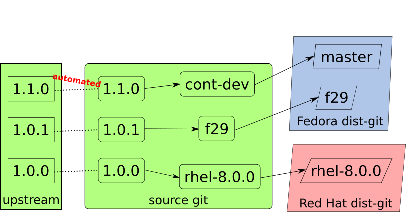

# Source-git
### Source git is the place where the manual work is done

This document serves as a detailed description of source-git. Please bear in
mind that some things are a subject to change — the overall design is pretty
solid, but details may be tinkered over time.

**Authors**: Stef Walter, Tomas Tomecek

Source git becomes the place for creative and interesting work, including
aspects of packaging requiring human effort. We allow dist-git to become an
auto-maintained location, used for tracking the current state of
Fedora, rather than the place where any actual development happens.

Because source git is the location for creative work, we can use modern
tooling, GitHub, GitLab, Pagure, pull requests, code review, continuous
integration and other modern development workflows.

In many cases source git can be the upstream project git itself (mostly with
projects where downstream maintainer is also the upstream maintainer). In other
cases source git can be a fork of upstream git (such as with the Linux kernel).

We take cues from projects that already do this. We use the distributed nature
of git repositories to overcome obstacles where certain parts of a package
(patches, spec, tests) can not (due to embargoes/secrets) or will not (due the
upstream project) be included in the upstream source git.

Bots are perfect candidates to perform the mundane tasks of auto-maintaining
dist-git. Whenever a bot gets stuck, it can always ask maintainer for help (or
the maintainer can perform the action for the bot).

## Premises
One of the fundamentally useless manual activities when a maintaining a package
in Fedora is moving code from one git repository format to another.
a) git is distributed
b) dist-git content is mostly boilerplate or regurgitated data.

Linux distributions gain an advantage from having patches incorporated upstream
and not carrying them downstream.

Human effort should not be focused on repetitive automatible tasks related to
churn and moving code around.

Dist-git is used as a store of state for build tools (like koji). Reinventing
dist-git itself fundamentally, means reinventing a lot of tooling.

## Principles
Dist-git tracks the inputs for and source state of a package build in Fedora.
It is not a place for development. It is the place where integration happens.

A Dist-git branch may diverge from the stable state of a Fedora release. The
stable state is represented by which builds were tagged into the stable
compose, not by what is in dist-git.

Aim to do Fedora development of a package in source git. Either directly in
upstream or in downstream git forks and branches of the upstream (see the
kernel for longest running example of this).

Any repetitive task, whether repetitive for a single package, or repetitive
across packages should be owned by bots auto-maintaining dist-git. Any creative
non-automatable human task should be done in source git.

Any task done by a maintainer bot, must be able to be performed by a human when
that is required. The bots must be capable of recovering from such situation.

We must be able to iterate on all parts of the bots (testing a change, merging
a change, deploying to production) at a pace of at least every two weeks. To
accomplish this, bots’ release and validation processes are completely
automated.

Contributions to the bots must be possible by any developer, maintainer,
tester, or other engineer. Any Fedora developer or tester should be able to
reproduce a bot locally on their machine, given appropriate credentials.

We are starting this project open source from the beginning.

## Acceptance Criteria
In the ideal path, dist-git should be completely automatically “maintained”
(already done to varying extents in the kernel, systemd, cockpit, ostree, conu,
colin and other packages).

It must be trivially possible to opt in and out of auto-maintenance for a given
dist-git branch.

It should continue to be possible for a human to fix up a dist-git branch, in
cases where a task was done incorrectly by a bot. Bots may overwrite such
fixups.

Each auto-maintained dist-git branch tracks a branch in a source git
repository. The source git branch should share a common git history with the
upstream project branches if maintainer desires such functionality.

Each time the HEAD of the git source branch changes, a process is started to
update dist-git to reflect those changes. This process may also be triggered
manually via a tool. If the dist-git is not in an expected state (last commit
is not from the bot), the bot should report such divergence.

Only the most recent signed commit is a candidate for pulling into dist-git.

Source code and patches are pulled from source git branch:
* The source code is the git source branch itself.
* The latest git tag of the git source branch is treated as the release.
* It must be possible to ignore certain tag patterns.
* Any commits after that tag in the git source branch are treated as additional
  patches to be distributed.
* In order to turn it into an SRPM and include it into dist-git it may be
  automatically turned into a tarball via an archive command on its latest tag.
* It must also be possible to use released tarballs from a project if available
  and necessary for a given dist-git repository, and layer patch files on top
  in dist-git.

Spec files are pulled from source:
* In the ideal case a spec file is maintained upstream in the same git
  repository as the source code. This is similar to how many projects have a
  Dockerfile.
* When upstream does not accept a spec file, it should be placed as an
  additional commit in the source git branch, and carried as if it were a
  patch.
* To allow trivial revert, review and merge workflows, the release number of
  the spec file is automatically generated (eg: SuSE and OBS). The release
  number should be present in the SRPM file name and contents.
* `%changelog` in an SRPM is automatically generated from the commits in source
  git repository. Various techniques may be used to collapse history.
* Project specific tooling in the source git repo can be used to generate the
  spec file (eg: as seen today in the kernel). We must provide reference
  implementation of such script.
* A spec file can be auto-generated for new packages, and reviewed by a human,
  who can do FIXUPs.
  * See: https://github.com/clearlinux/autospec

Tests are pulled from source:
* Components of the operating system have integration and acceptance tests.
* In the ideal case these are maintained upstream in the given project. They
  are treated similar to source code.
* When an upstream does not accept a test, it should be placed as an additional
  commit in the branch of the git source repository, and carried as if it was a
  patch.
* Tests should be wrapped in such a way that anyone can easily (2 commands at
  most) execute them locally and iterate on them with good velocity. These
  tests need to pass in order the component to be included in a compose.

After a bot makes a change to dist-git it automatically triggers the koji build.

The build in koji is validated that it works with the rest of the operating
system packages in that branches compose. If it does it is then tagged into the
compose.

When validation fails, feedback goes back to the upstream project. At an
absolute minimum the owner of the source git change. But it must be possible to
send feedback to a minimal set of Git Forges (GitHub, GitLab, etc.).

Instead of configuring the bots globally, the bot entry points (configuration)
should live in the dist-git repositories (or source-git). The entry points may
contain package specific code and variables that can affect the bot
implementation for that repository.

Manual activities take place on source git. Humans may be involved in:
* Investigation of build, test, or packaging failures
* Material changes to spec files
* Material changes to test wrappers
* Writing documentation that describe the new changes
* Changes to packaging and delivery policy

We must get credentials for the bots to perform these activities. We must
implement metering in the beginning to prevent bots going wild across the
entire dist-git repository.

Any change to the bots must self-validate by comparing recent bot behavior on
recently changed dist-git repositories, and seeing if they have similar
behavior.

## Specifications and Interfaces

### Configuration in dist-git
In order to automate dist-git and pull from source git, an extensible
configuration file would be placed in dist-git (or source-git).

Placing this config in a branch in dist-git indicates that that dist-git branch
should be auto-maintained. The config may be removed to turn off
auto-maintenance. There is one config per auto-maintained branch, e.g. a config
in f28 dist-git branch implies the branch is auto-maintained and points to
specific source git branch.

It should at a minimum support:

* Which source git repository to pull from.
* Which branch in that source git repository to pull from.
* Optional: A container to do dist-git population with
* Defaults to the ‘default’ container (see below)
* Optional: An expression that describes how to parse tags in source git as versions
* This can be completely overridden by the container (see below)
* Eg: v4.9-rc8 -> 4.9
* Optional: Which Koji buildroots to build in
* Defaults to the one decided by fedpkg
* Optional: GPG key ids considered valid for signing packages.

### Source git best practices
New upstream releases will result in new source-git branches. We can't rebase
existing branches since we would lose the provenance.

The diagram showcases how upstream releases (git tags) correspond to source git
dist-git branches. New releases are automatically detected and proposed as a
pull request. Once the packaging is completed, new corresponding branch is
created and the new release should land in a continuously development (cont-dev)
branch. Please bear in mind, that in order for a pull request to be merged, it
needs to pass all the validation. Therefore in order for the 1.1.0 upstream
release to land in the 1.1.0 source git branch, all the tests have to pass.

It’s up to a maintainer then to cherry-pick which changes should land in a
selected downstream dist-git branch.

### Population of dist-git
The actual population of dist-git and source git. Specification of the
population process:
* The input, checked out source git will be placed in a known path.
* The container should process the input and place it to a well known path.
* The container image can live in any registry.
* Every maintainer will be able to create a container image to perform the
  population on their own, given it follows the specification.

After the population process is done, the bot collects the output, performs a
commit, signs it and pushes to dist-git.

These two population mechanisms (=container images) will be available to maintainers:
* Default: produce an archive out of the source git content. No patch files.
* Upstream tarball: Take upstream release tarball and lay additional commits as patches on top.
  * Use case: Cockpit (where tarball very diverged from git)

### Signing of source git
This is a description of the initial proposal to perform signing of commits.
Our expectation is that the design will evolve over time.

The HEAD commit on the tracked branch in source git, which represents the
content to land in dist-git (see above), must be signed. When new commits are
pushed to source git, a bot checks signatures used to sign those commits. The
signature IDs which are approved to push to dist-git need to be specified in a
configuration file placed in dist-git. If the signature ID is not in the
configuration file, the commit is not synced and the bot notifies owners of the
source git repository.

Workflow:
* A new signed commit is pushed to source git.
* A bot detects the commit, validates that it is signed using an approved
  signature.
  * If not, notifies maintainer to resolve the issue.
* If the signature is valid, the bot prepares population of dist-git.
  * It uses the mechanism described in in previous section “Population of dist-git”.
  * Before pushing to dist-git, the bot signs the commit with its own key.
  * The bot also references the respective source git commit(s).
* The commit is pushed to dist-git.

Summary: all commits in dist-git, which are curated by a bot, are signed with
bot’s key. The commit message then references the commits in source git. All
the mentioned commits need to be signed so it’s possible to figure out who
authored and approved the work.

